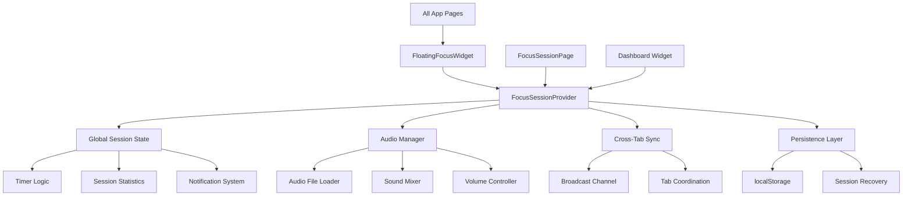
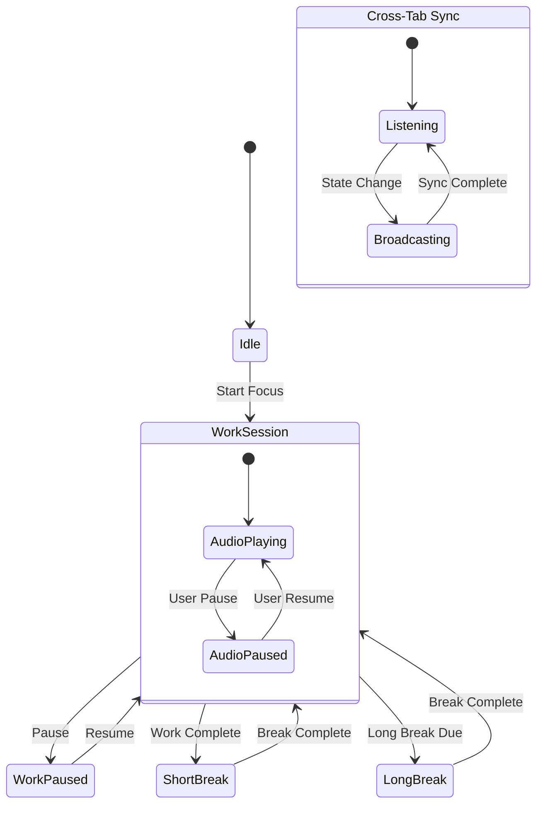

# Design Document

## Overview

The Advanced Focus Session system transforms the existing focus session functionality into a globally accessible, persistent, and deeply integrated productivity tool. The design centers around a global context provider that manages session state across the entire application, a floating control widget for universal access, real audio file integration, and cross-tab synchronization using the Broadcast Channel API.

## Architecture

### Core Components Architecture



### State Management Flow



## Components and Interfaces

### 1. FocusSessionProvider (Global Context)

**Purpose:** Central state management for focus sessions across the entire application.

**Key Interfaces:**
```typescript
interface FocusSessionState {
  // Session State
  isActive: boolean;
  currentState: 'work' | 'shortBreak' | 'longBreak' | 'idle';
  timeLeft: number;
  isRunning: boolean;
  completedSessions: number;
  sessionStartTime: number | null;
  
  // Settings
  settings: FocusSessionSettings;
  
  // Audio State
  audioState: AudioState;
  
  // UI State
  floatingWidgetVisible: boolean;
  floatingWidgetMinimized: boolean;
}

interface AudioState {
  currentSounds: ActiveSound[];
  masterVolume: number;
  isMuted: boolean;
  isLoading: boolean;
  presets: SoundPreset[];
}

interface ActiveSound {
  id: string;
  name: string;
  volume: number;
  audioElement: HTMLAudioElement;
  isPlaying: boolean;
}
```

**Core Methods:**
- `startSession()` - Initialize new focus session
- `pauseSession()` - Pause current session
- `resumeSession()` - Resume paused session
- `completeSession()` - Handle session completion
- `resetSession()` - Reset current session
- `updateSettings()` - Update session settings
- `toggleFloatingWidget()` - Show/hide floating controls

### 2. AudioManager

**Purpose:** Handles real audio file playback, mixing, and advanced audio features.

**Key Features:**
- Preloads audio files for instant playback
- Supports mixing multiple sounds simultaneously
- Implements crossfading between sound transitions
- Manages audio presets and user preferences
- Handles audio context suspension/resumption

**Implementation Details:**
```typescript
class AudioManager {
  private audioElements: Map<string, HTMLAudioElement> = new Map();
  private audioContext: AudioContext;
  private masterGainNode: GainNode;
  private soundNodes: Map<string, GainNode> = new Map();
  
  async preloadAudio(soundId: string): Promise<void>
  async playSound(soundId: string, volume: number): Promise<void>
  async stopSound(soundId: string): Promise<void>
  async crossfadeToSound(fromId: string, toId: string): Promise<void>
  mixSounds(sounds: { id: string, volume: number }[]): void
  savePreset(name: string, sounds: ActiveSound[]): void
}
```

### 3. FloatingFocusWidget

**Purpose:** Persistent, draggable control widget visible on all app pages.

**States:**
- **Minimized:** Small circular indicator showing time remaining
- **Compact:** Essential controls (play/pause, time, session type)
- **Expanded:** Full controls including audio mixer and settings

**Positioning:**
- Draggable to any screen position
- Remembers position in localStorage
- Smart positioning to avoid UI conflicts
- Responsive design for mobile devices

### 4. CrossTabSynchronizer

**Purpose:** Ensures consistent session state across multiple browser tabs.

**Implementation:**
```typescript
class CrossTabSynchronizer {
  private broadcastChannel: BroadcastChannel;
  private isLeader: boolean = false;
  
  constructor() {
    this.broadcastChannel = new BroadcastChannel('focus-session');
    this.setupLeaderElection();
    this.setupMessageHandling();
  }
  
  broadcastStateChange(state: Partial<FocusSessionState>): void
  handleIncomingMessage(message: SyncMessage): void
  electLeader(): void
  transferLeadership(): void
}
```

### 5. Enhanced Audio Components

#### RealAudioPlayer
Replaces the current generated sound system with actual audio file playback:

```typescript
interface RealAudioPlayerProps {
  sounds: SoundOption[];
  activeSounds: ActiveSound[];
  onSoundToggle: (soundId: string) => void;
  onVolumeChange: (soundId: string, volume: number) => void;
  onPresetSave: (preset: SoundPreset) => void;
}
```

#### AudioMixer
Advanced mixing interface for combining multiple sounds:

```typescript
interface AudioMixerProps {
  maxSounds: number; // Default: 3
  availableSounds: SoundOption[];
  currentMix: ActiveSound[];
  onMixChange: (mix: ActiveSound[]) => void;
  presets: SoundPreset[];
}
```

## Data Models

### Enhanced Sound System

```typescript
interface SoundOption {
  id: string;
  name: string;
  icon: string;
  description: string;
  filePath: string; // Path to actual audio file
  type: 'nature' | 'white-noise' | 'binaural' | 'ambient';
  duration?: number; // For non-looping sounds
  tags: string[]; // For categorization and search
  recommendedVolume: number; // Optimal volume level
}

interface SoundPreset {
  id: string;
  name: string;
  sounds: {
    soundId: string;
    volume: number;
  }[];
  createdAt: Date;
  usageCount: number;
}
```

### Session Analytics

```typescript
interface SessionAnalytics {
  totalSessions: number;
  totalFocusTime: number; // in minutes
  averageSessionLength: number;
  longestStreak: number;
  currentStreak: number;
  preferredSounds: string[];
  productivityScore: number; // Calculated metric
  weeklyStats: WeeklyStats[];
}

interface WeeklyStats {
  week: string; // ISO week
  sessions: number;
  focusTime: number;
  completionRate: number;
}
```

## Error Handling

### Audio Error Recovery
- **File Loading Failures:** Fallback to generated sounds with user notification
- **Audio Context Issues:** Automatic retry with user interaction prompt
- **Cross-browser Compatibility:** Feature detection and graceful degradation

### State Synchronization Errors
- **Tab Conflicts:** Automatic conflict resolution with leader election
- **Storage Failures:** In-memory fallback with session recovery on next load
- **Network Issues:** Offline mode with local state persistence

### User Experience Errors
- **Widget Positioning:** Reset to default position if saved position is invalid
- **Settings Corruption:** Reset to defaults with user notification
- **Timer Drift:** Automatic correction using performance.now() timestamps

## Testing Strategy

### Unit Testing
- **AudioManager:** Test audio loading, mixing, and playback functionality
- **CrossTabSynchronizer:** Test message broadcasting and leader election
- **FocusSessionProvider:** Test state transitions and persistence
- **Timer Logic:** Test accuracy and drift correction

### Integration Testing
- **Cross-Tab Scenarios:** Multiple tabs with various interaction patterns
- **Audio Integration:** Real audio file playback across different browsers
- **State Persistence:** Browser refresh and session recovery scenarios
- **Widget Interactions:** Floating widget behavior across different pages

### Performance Testing
- **Audio Loading:** Measure preload times and memory usage
- **State Updates:** Test performance with frequent state changes
- **Cross-Tab Sync:** Measure latency and reliability of synchronization
- **Memory Leaks:** Long-running session testing for resource cleanup

### User Experience Testing
- **Navigation Flow:** Session continuity across all app pages
- **Audio Quality:** Sound mixing and volume control responsiveness
- **Widget Usability:** Floating widget positioning and interaction
- **Accessibility:** Keyboard navigation and screen reader compatibility

## Implementation Phases

### Phase 1: Core Infrastructure
1. Create FocusSessionProvider with basic state management
2. Implement real audio file integration
3. Add persistence layer with localStorage
4. Create basic FloatingFocusWidget

### Phase 2: Advanced Features
1. Implement CrossTabSynchronizer
2. Add audio mixing capabilities
3. Create preset system for sound combinations
4. Enhance notification system

### Phase 3: Polish and Optimization
1. Add advanced analytics and insights
2. Implement smart suggestions and AI features
3. Performance optimization and caching
4. Comprehensive testing and bug fixes

## Security Considerations

- **Audio Files:** Validate file types and implement CSP headers
- **Cross-Tab Communication:** Sanitize broadcast messages
- **Local Storage:** Encrypt sensitive session data
- **User Privacy:** Ensure analytics data remains local unless explicitly shared